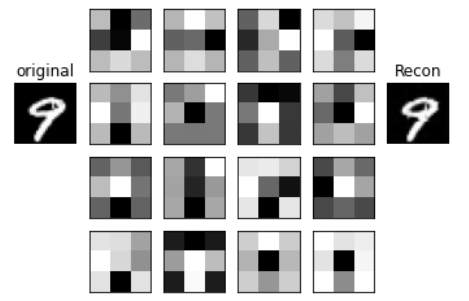
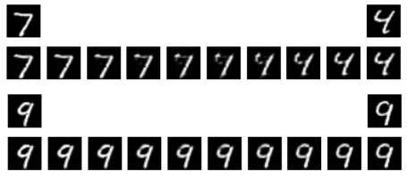

# Autoencoder_convolucional

Este repositorio contiene código escrito en python para generar un autoencoder convolucional utilizando pytorch, utilizando la base de datos de dígitos escritos a mano MNIST. 
Fue escrito como trabajo final de la materia [*Redes Neuronales 2020*](https://www.famaf.unc.edu.ar/~ftamarit/redes2020/), 
dictada virtualmente en la Facultad de Matemática, Astronomía, Física y Computación (FaMAF) de la Universidad Nacional de Córdoba (UNC).

### Ejemplo de interpolación en el espacio embebido

